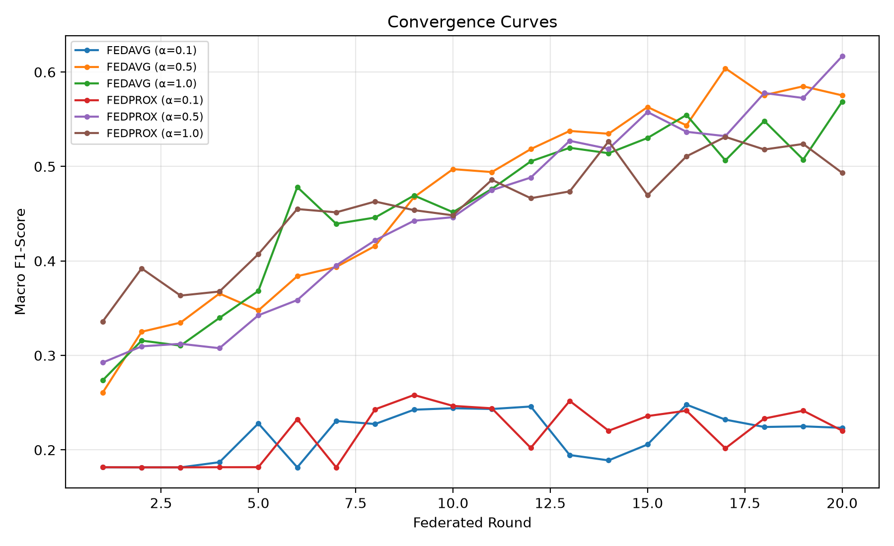
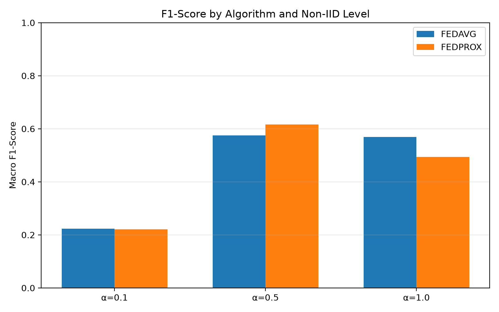
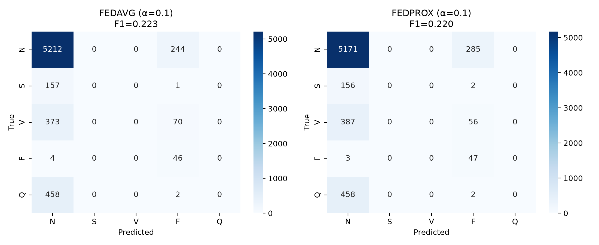

# Federated Learning for Privacy-Preserving ECG Arrhythmia Classification under Non-IID Data Distributions

**Author:** Sultan Ali Khan  
**Email:** sultanalikhan0344@gmail.com  
**Paper (Zenodo DOI):** [10.5281/zenodo.23215743](https://doi.org/10.5281/zenodo.23215743)
**Paper PDF:** [`paper/Federated_ECG_Arrhythmia_SultanAliKhan.pdf`](paper/Federated_ECG_Arrhythmia_SultanAliKhan.pdf)

---

## Abstract

Cardiovascular diseases remain the leading cause of mortality worldwide, and early detection of arrhythmias via electrocardiogram (ECG) analysis is critical for effective intervention. Centralized machine learning approaches for ECG classification require aggregating sensitive patient data, raising significant privacy concerns. Federated Learning (FL) offers a promising alternative by enabling collaborative model training without exchanging raw data. Yet, real-world clinical data across hospitals is inherently non-independent and identically distributed (non-IID) due to demographic variation, equipment differences, and local disease prevalence. This paper presents a preliminary empirical study of FL for ECG arrhythmia classification under controlled non-IID conditions. Using the MIT-BIH Arrhythmia Database, we simulate five hospital clients partitioned with Dirichlet distributions (α ∈ {0.1, 0.5, 1.0}) and compare Federated Averaging (FedAvg) and Federated Proximal (FedProx) using a compact 1D CNN with class-weighted loss.

## Key Findings

- **Both FedAvg and FedProx collapse under severe non-IID** (α = 0.1), achieving macro F1 ≈ 0.22 while never predicting minority classes (S, V, Q).
- **FedProx outperforms FedAvg under moderate non-IID** (α = 0.5), improving macro F1 by 4.1 percentage points (0.617 vs. 0.575).
- **The ordering reverses under mild non-IID** (α = 1.0) — FedAvg leads (F1 = 0.569 vs. 0.493), highlighting the heterogeneity-dependent nature of the proximal term.

## Results

| Algorithm | α = 0.1 | α = 0.5 | α = 1.0 |
|---|---|---|---|
| **FedAvg** | F1 = 0.2234, Acc = 0.8007 | F1 = 0.5753, Acc = 0.8113 | **F1 = 0.5687**, Acc = 0.8068 |
| **FedProx** | F1 = 0.2204, Acc = 0.7946 | **F1 = 0.6167**, Acc = 0.8643 | F1 = 0.4933, Acc = 0.6700 |

## Figures

| Convergence | F1 Comparison | Confusion Matrices (α = 0.1) |
|---|---|---|
|  |  |  |

## Repository Structure

├── paper/ # Compiled PDF of the paper
├── data/ # MIT-BIH CSVs (download separately)
├── src/
│ ├── data_utils.py # Data loading and Dirichlet partitioning
│ ├── model.py # 1D CNN architecture
│ ├── client.py # Federated client (local training)
│ ├── algorithms.py # Aggregation utilities
│ └── train_federated.py # Federated training loop
├── experiments/
│ └── run_all.py # Main experiment script
├── results/ # Generated figures and result files
├── requirements.txt
├── CITATION.cff
└── LICENSE


## Quick Start

### 1. Clone the repository
```bash
git clone https://github.com/<YOUR-USERNAME>/federated-ecg-research.git
cd federated-ecg-research

pip install -r requirements.txt

Download the MIT-BIH dataset
Download mitbih_train.csv and mitbih_test.csv from:
Kaggle: ECG Heartbeat Categorization Dataset

Place both files in the data/ directory.

4. Run the experiments
python experiments/run_all.py


 Run the experiments
bash
python experiments/run_all.py
Results will be saved in results/.

Requirements
Python 3.10+

PyTorch 2.0+

See requirements.txt for full list

Citation
If you use this code or paper in your research, please cite:

bibtex
@misc{khan2026federated,
  title={Federated Learning for Privacy-Preserving ECG Arrhythmia Classification under Non-IID Data Distributions: A Preliminary Study},
  author={Khan, Sultan Ali},
  year={2026},
  howpublished={Zenodo preprint},
  doi={10.5281/zenodo.XXXXXXX},
  url={https://doi.org/10.5281/zenodo.XXXXXXX}
}
License
This project is licensed under the MIT License — see LICENSE for details.

Contact
Sultan Ali Khan
Email: sultanalikhan0344@gmail.com

For questions, issues, or collaborations, please open an issue on GitHub or email directly.

text

**⚠️ Replace `<YOUR-USERNAME>` and `10.5281/zenodo.XXXXXXX` with your actual GitHub username and Zenodo DOI.**

---

## 📄 Step 3: Create the `CITATION.cff` File

Create a file named **`CITATION.cff`** in your project root:

```yaml
cff-version: 1.2.0
message: "If you use this code or paper in your research, please cite it as below."
title: "Federated Learning for Privacy-Preserving ECG Arrhythmia Classification under Non-IID Data Distributions: A Preliminary Study"
abstract: "This paper presents a preliminary empirical study of Federated Learning for ECG arrhythmia classification under non-IID data distributions using the MIT-BIH Arrhythmia Database."
authors:
  - family-names: "Khan"
    given-names: "Sultan Ali"
    email: "sultanalikhan0344@gmail.com"
year: 2026
month: 10
day: 7
version: "1.0.0"
license: MIT
type: software
repository-code: "https://github.com/<sultanalikhan7543>/federated-ecg-research"
doi: "10.5281/zenodo.23215743"
keywords:
  - federated learning
  - ECG arrhythmia classification
  - non-IID data
  - privacy-preserving healthcare
  - Dirichlet partitioning
  - FedProx
